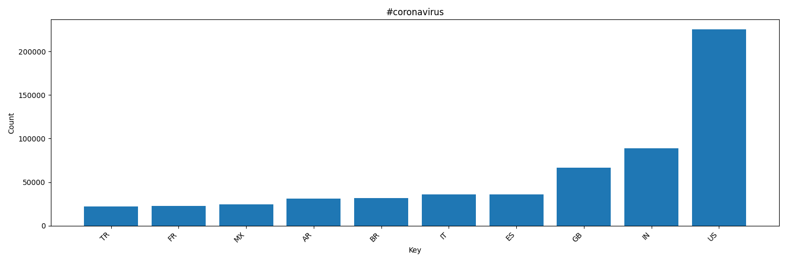
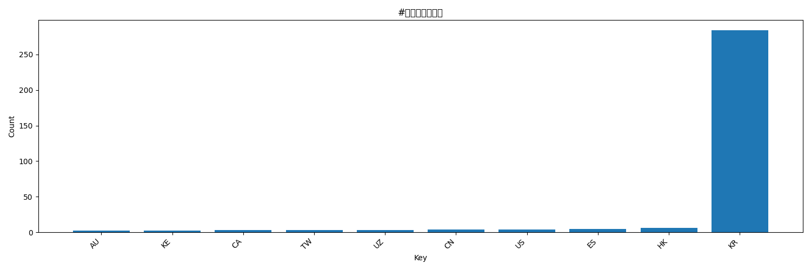
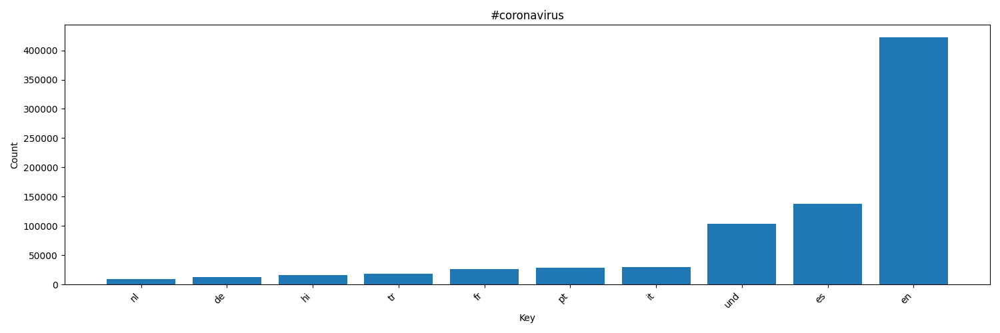
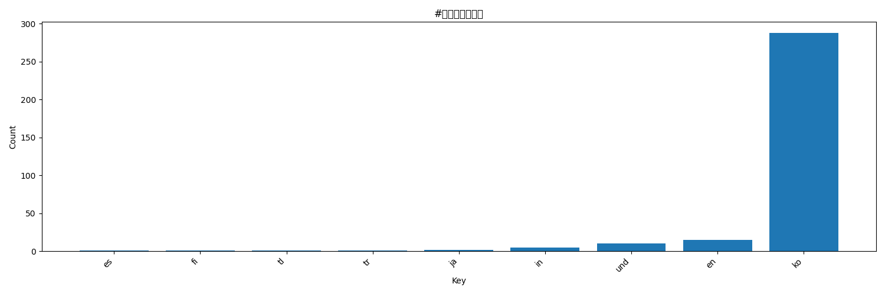
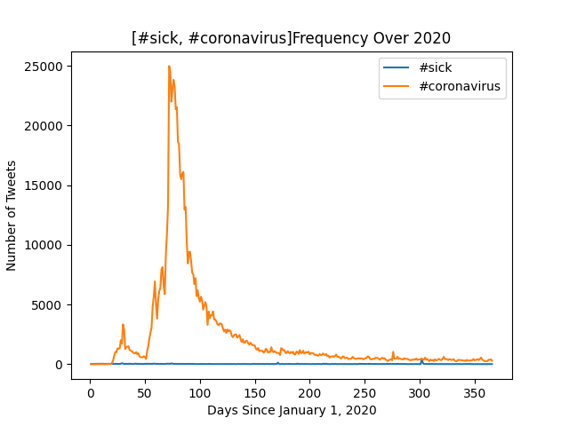

# Coronavirus twitter analysis

This project scanned all geotagged tweets (about 1.1 billion tweets), narrowed down to all tweets sent in 2020 to monitor for the spread of the coronavirus on social media. The instructions followed for this analysis can be found at <https://github.com/mikeizbicki/twitter_coronavirus>

## MapReduce Process
Used MapReduce to sort through tweets. I looked at 17 [hashtags](hashtags) in particular. That list can be found <hashtaglist>. The map step counted all the tweets featuring those hashtags based on their language and country. Code can be found [here](src/map.py). The reduce step combined each day of 2020's data together and can be found [here](src/reduce.py). All the outputs of the mapping step are in the outputs folder, and outputs of the Reduce step are found in the [combined.country](src/combined.country) and [combined.lang](src/combined.land) files. 

## Alternative MapReduce
The reduce process was then modified to take a list of hashtags as inputs, and then track each hashtag's count for each day of the year. This process can be found [here](src/alternative_reduce_v2.py). 

## Visualizations

Shows top 10 countries where tweets with "#coronavirus" originated from. 

Shows top 10 countries where tweets with "#코로나바이러스" originated from. 

Shows top ten langauges of tweets with "#coronavirus". 

Shows top 10 langauges of tweets with "#코로나바이러스". 

Shows how #coronavirus" and "sick" changed in their usage across 2020. 

